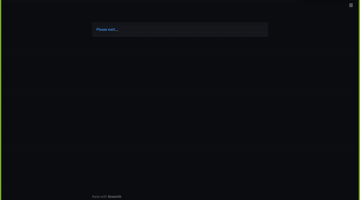
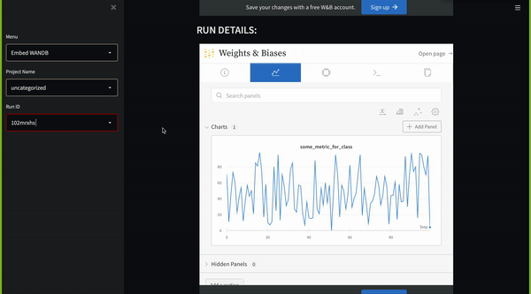
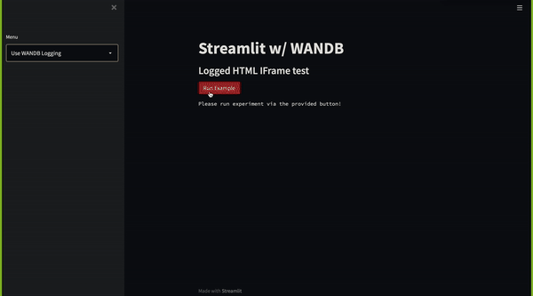

# Using W&B and Streamlit

## Description

Example repo to show off the different possibilties when utilizing both W&B and Streamlit. In this repo we hit two scenarios in terms of interaction with W&B and Streamlit.

1. Embed an IFrame of the WANDB dashboard within the Streamlit application. This is shown in the application when selecting the `Embed IFrame` option. In this variant we allow users to select a project and run. We then display both the project dashboard and run dashboard from WANDB

2. Use WANDB traiditionally to log artifacts that can be pulled from an experiment to visualize traditionally. This is shown in the application when selecting the `Use WANDB Logging` option. In this variant we provide a minimal example of an WANDB experiment that can be run to the users account upon click. When said experiment is finished, it should load in a logged HTML page saved in WANDB to the file directory of the Streamlit project to then be displayed by Stteamlit.

## Install

```
pip install -r requirements.txt
```

Generate a `.env` file in the root of the project with variables:

```
WANDB_API_KEY=<WANDB_API_KEY>
WANDB_ENTITY=<WANDB_ENTITY_NAME>
```

## Usage

To run streamlit on localhost use command: `streamlit run wandb_streamlit_app.py`

## Examples

### WANDB Project Dashboard



### WANDB Run Dashboard



### WANDB HTML Artifact rendered via Streamlit


